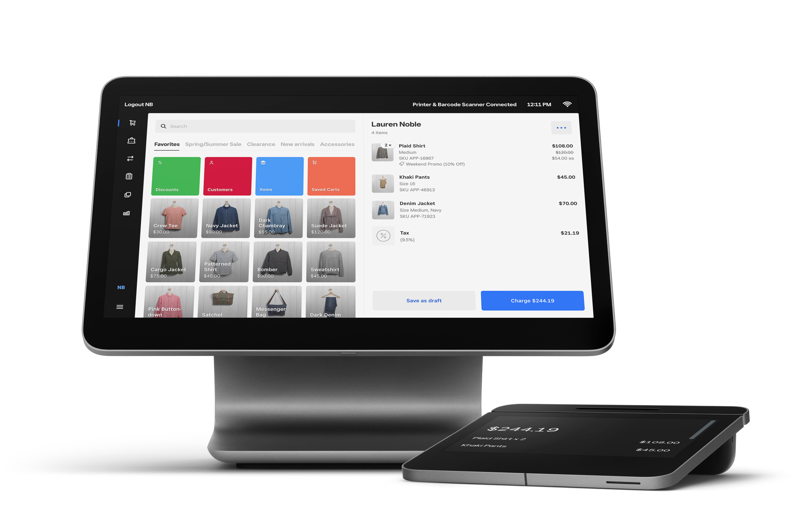
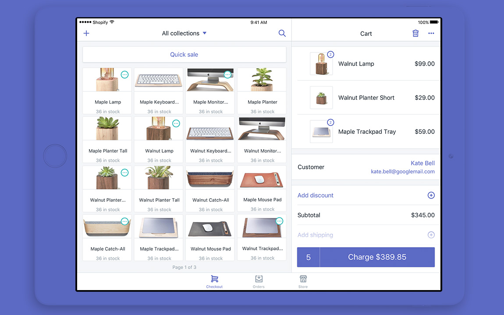
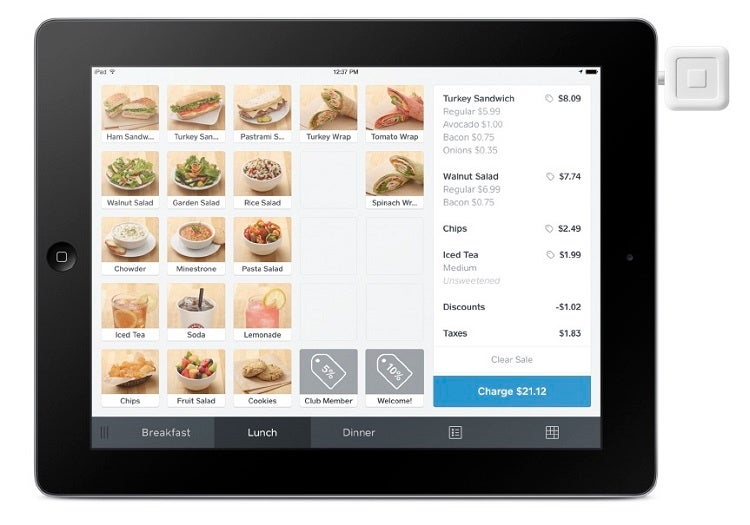
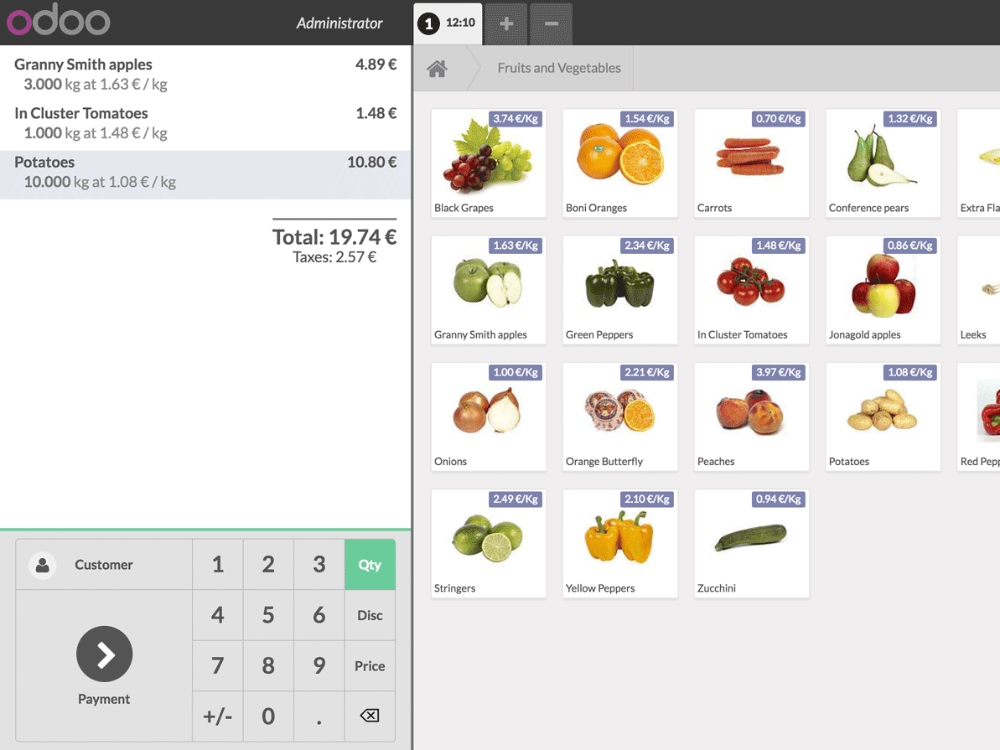
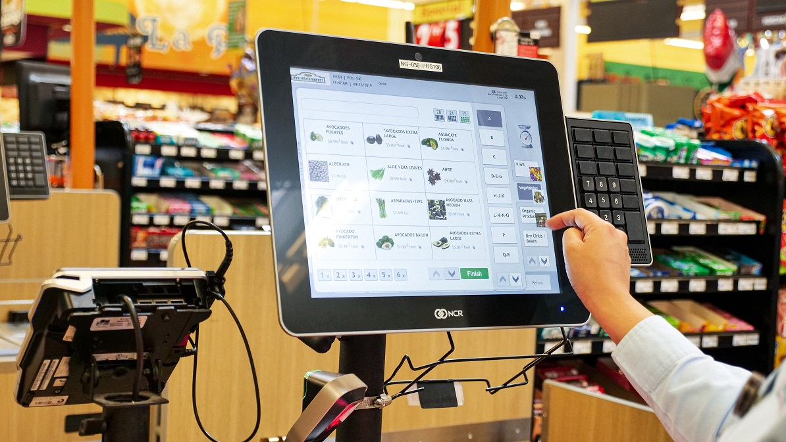
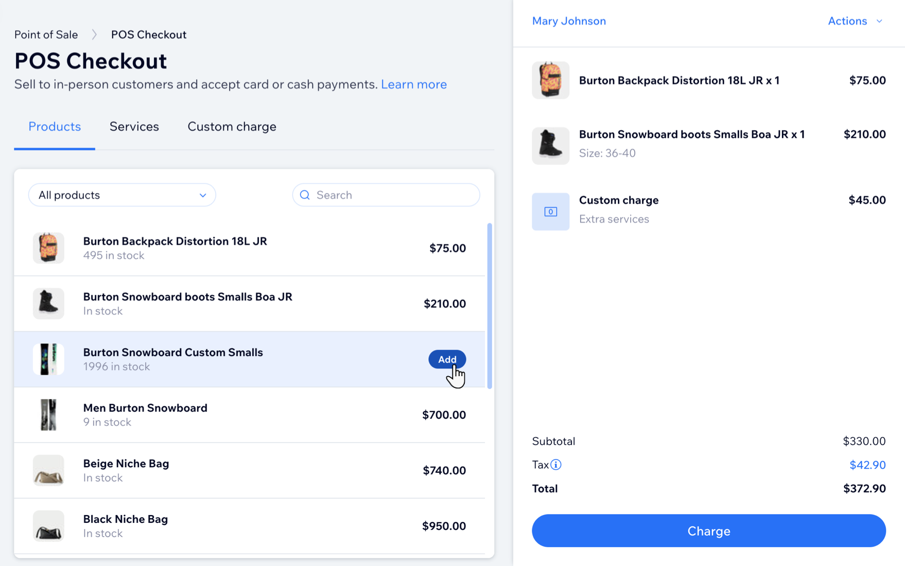
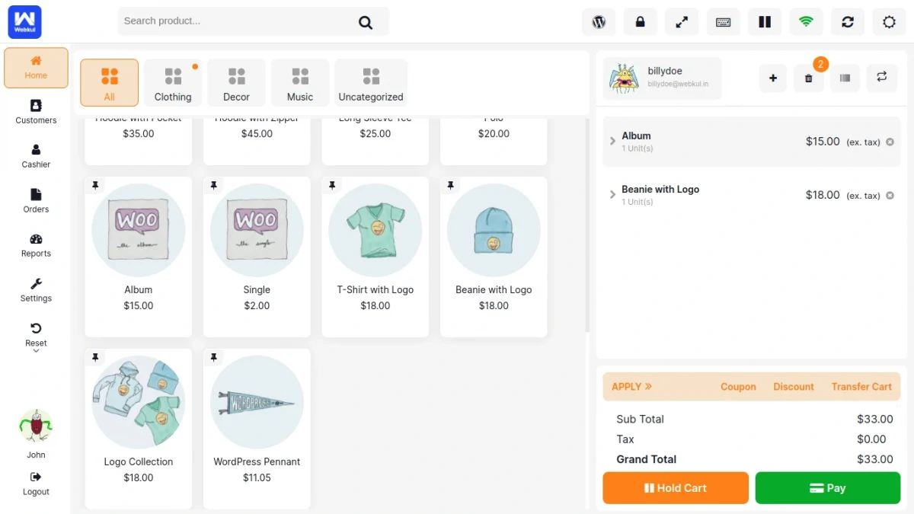
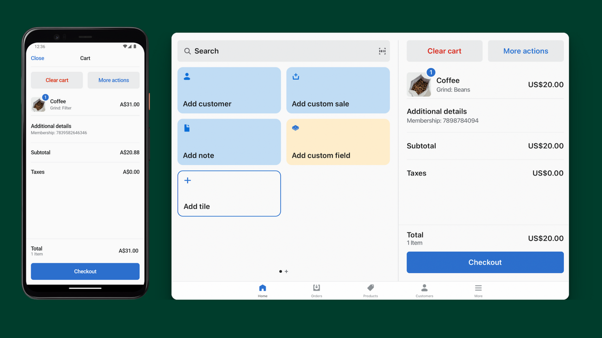

# 24/6/26 ui design / field research

First pass for D4 was getting Opus to draw three different checkout mockups
using the real `wwwroot/app.css` tokens:

* [A, two-column till](mockups/a-two-column-till.html): scan/reference on the
  left, basket/total on the right.
* [B, receipt column](mockups/b-receipt.html): single-column receipt flow.
* [C, keypad grid](mockups/c-keypad-grid.html): SKU tiles as the main add action,
  text entry as fallback.

Then after my notes and an adversarial critique from a different model, Opus drew
[D, receipt rail](mockups/d-receipt-rail.html): basically B's receipt flow, but
with a sticky total and a side rail where each SKU row is also the add button.

This was useful, even though I don't think any of A-D is the final answer. It got
me a quick feel for how the layouts behave:

* A proved the price list needs to stay visible. If the cashier asks "what's D
  again?", making them open something is bad.
* B proved the receipt-shaped flow works better narrow.
* C made me rethink tapping the item. I originally marked it down as not scaling,
  but real POS screens make that look like the wrong worry.
* D is closest so far because it combines the receipt flow with an always-visible
  reference/add surface.

My main critique is still that they all look too SaaS-ey. Rounded white cards,
grey canvas, one accent colour, system font, even padding everywhere. It reads
like a dashboard skin on a till. When basket, total and reference are all cards,
the total is just bigger text in another box.

I did try pushing the opposite direction too: dark hardware, seven-segment total,
thermal receipt styling. That was worse. Memorable screenshot, but it turns the
UI into costume. So the next pass needs to be less SaaS-card, but also not fake
hardware.

## Research step

After D I looked at real POS examples to check whether I'd accidentally landed on
normal patterns, what I should copy, and what parts of retail POS don't apply
here.

References are in `scratch/refs/`. Most are vendor screenshots because that's
what's easy to find. The NCR image matters most because it's an actual
supermarket lane terminal, not a small-business catalogue checkout.

## User / intent

This is for a cashier at a till, not a shopper.

What they do most:

* Add an item quickly.
* Glance at the running total.
* Explain why an offer changed the price.
* Fix mistakes: wrong scan, double scan, remove one line, clear basket.

Things I should mostly ignore: product photos, browsing, marketing categories,
"discover more" anything. We have four single-letter SKUs with no images and no
barcodes. Anything that costs an extra glance per scan is expensive.

## References

### Square Register

Keep: touch-first add, struck original price, named promo, and a customer-facing
total. Drop: photographed catalogue and total-on-payment-button, since checkout
is mocked here.

### Shopify POS

Same broad pattern as Square, but the charge area is clearer: basket count on the
left of the button, total on the main action. That is probably the version to copy
for revision E. The catalogue/product photos still do too much for four SKUs.

### Square Restaurant

Useful because the ticket shows line detail without losing the charge action.
Modifiers are out of scope, but discounts/taxes sitting above `Charge $21.12`
reinforce the same thing: explain the price, then pin the total to the action.

### Odoo POS

Keep: keypad attached to the ticket. That gives a path for "add three of A" as
one action. Drop: weight pricing and manual price entry.

### NCR supermarket lane terminal

Best interaction reference. Touch picks the item, hardware keys handle numbers,
and the A-Z index avoids scrolling through a giant catalogue. The screen is
dense and dated, but the model is right for this: touch-first with keyed fallback.

### Wix POS checkout

This is basically D's reference-row-as-add-control in the wild. For this kata I'd
strip the row to SKU, price, offer and add button.

### WooCommerce / Webkul POS

Useful mostly as a warning. It has the expected product grid and cart split, but
the screen is busy: side nav, top toolbar, categories, apply/coupon/discount row,
hold cart and pay. For this kata, copy the simple cart/pay separation and avoid
all the surrounding management UI.

### Shopfields phone and tablet

Responsive note: same controls, one column on phone and two on tablet. That
matches the no-JS form path.

## Carry forward to E

Current read:

* Typed SKU entry should be fallback, not primary.
* The four SKUs should be big press targets showing price and offer.
* Still keep a text field for manual/scan/no-JS fallback.
* Add a quantity affordance so "three of A" isn't three taps.
* Price reference and add control should be the same surface.
* Total needs to be prominent, not just another card. Pin it to the checkout
  button.
* Offers need to show base price, named offer and saving.
* No colour-only signalling. Use text/minus sign as well as the
  `--color-success-*` tokens.
* Keep the four reachable states: empty basket, item added, validation error,
  clear-on-empty.
* No-JS first. Real form posts for mutations; Interactive Server can sharpen the
  running total.
* Touch targets are a token, not a guess. A `--touch-target-min` floor of 44px
  (WCAG 2.5.5 / Apple HIG) drives the SKU keys, both steppers, and the
  Clear/Charge actions, bumped to 48px under `@media (pointer: coarse)` for
  phone/tablet glass. Reducing visual padding must not drop a control below that
  floor; pin the height to the token and let padding shrink.
* Styling target: work-tool, compact receipt, clear total, large add targets,
  visible offers. Less SaaS-card, less hardware costume.

Follow-up E hardening:

* Keep a persistent assistive live region separate from the visual toast, so
  toast visibility changes do not swallow announcements.
* When a focused receipt line is removed, move focus to the next line control or
  back to the add pad instead of dropping focus on the document.
* Shape mockup forms like the production no-JS contract (`method`/`action` on
  add, line quantity, clear and charge paths), even though the static file still
  intercepts them for the live demo.
* Treat the JavaScript as disposable interaction scaffolding: JSDoc-typed,
  `// @ts-check` friendly, and escaped where it still uses string-built markup.
